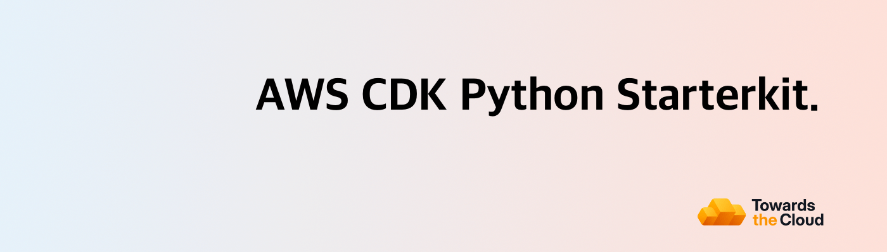

# [](https://towardsthecloud.com)

# AWS CDK Python Starterkit

> The perfect starter kit to create and deploy an AWS CDK App using Python on your AWS account in less than 5 minutes using GitHub actions!

[](https://github.com/towardsthecloud/aws-cdk-starterkit/actions/workflows/build.yml)
[](https://github.com/astral-sh/ruff)

## Intro

Welcome to the starting line of your next AWS CDK project. This repository is crafted to supercharge your project's setup with AWS CDK Python, projen, and GitHub actions, ensuring a smooth and efficient deployment to your AWS account.

> [!TIP]
> **AWS Done Right: Ship Faster, More Securely, at Lower Cost!** Our [AWS CDK Landing Zone Service](https://towardsthecloud.com) helps B2B startups & enterprises achieve SOC 2 compliance 90% faster, reclaim 30% of developer capacity for product innovation while eliminating six-figure Cloud Engineering costs.
>
> Discover how we deliver 10x AWS infrastructure value while cutting costs.
>
> <a href="https://towardsthecloud.com/contact"></a>
>
> <details><summary>☁️ <strong>Learn more how we help businesses succeed on AWS Cloud...</strong></summary>
>
><br/>
>
> AWS promises simplicity but delivers complexity. Businesses struggle with security risks and compliance requirements that divert developers from core product work.
>
> Without AWS expertise, you face vulnerabilities, technical debt, and market delays while competitors race ahead.
>
> Traditional consultancies worsen this by prioritizing billable hours over outcomes.
>
> We take the opposite approach, focusing exclusively on business outcomes by eliminating AWS complexity, accelerating your developers, and securing your infrastructure through:
>
> ### Deploying a [Secure Landing Zone](https://towardsthecloud.com/services/aws-landing-zone)
> - Multi-account architecture with strict security boundaries
>   - **100% score** on [CIS AWS Foundation Benchmark](https://docs.aws.amazon.com/securityhub/latest/userguide/cis-aws-foundations-benchmark.html)
>   - **96% rating** on [AWS foundational security best practices](https://docs.aws.amazon.com/securityhub/latest/userguide/fsbp-standard.html)
> - Manage user access securely on AWS via Single Sign-On (SSO)
> - Full AWS CDK implementation (Infrastructure as Code)
> - Multi-region deployments supported
> - Cross-account monitoring and security alerts
> - View our [Roadmap](https://github.com/towardsthecloud/aws-cdk-landing-zone-roadmap) for all implemented and upcoming features
>
> ### Upskilling and accelerating your developers
> - They get access to our production-ready, security-hardened AWS CDK components
> - They receive AWS best practices guidance to prevent technical debt
>
> ### Providing support and maintenance
> - Landing Zone gets updates and security patches
> - Priority Slack/Teams support for infrastructure challenges
> - Quarterly [security](https://towardsthecloud.com/services/aws-security-review) and [cost optimization](https://towardsthecloud.com/services/aws-cost-optimization) assessments to stay compliant and reduce AWS costs
>
> ## What This Means For Your Business
> - **30% Lower TCO**: Cut Total Cost by 40% through right-sized resources while eliminating the $150K+ cost of a specialized AWS hire.
> - **Accelerate Development**: Redirect 30% of engineering time from infrastructure to revenue-generating features with pre-built, compliant CDK components.
> - **Compliance-Ready Infrastructure**: Meet security requirements from day one with architecture that [speeds up audit preparation by 90%](https://towardsthecloud.com/blog/aws-landing-zone-case-study-accolade) for SOC 2, HIPAA, and other security frameworks.
>
> All of this is included in a [fixed monthly subscription](https://towardsthecloud.com/pricing). No lock-in, no large upfront costs, just predictable monthly pricing.
>
> Book a free call to see how we deliver 10x AWS infrastructure value at a fraction of a Cloud Engineer's cost.
>
> <a href="https://towardsthecloud.com/contact"></a>
> </details>

## Features

- ⚡ Rapid Setup: Jumpstart your project within minutes by tweaking a [single configuration file](./.projenrc.py). Spend less time on boilerplate and more on building.
- 🤹‍♂️ Multi-Account Flexibility: Ready for enterprises, this starter kit supports multi-account setups right from the start, enabling scalable and segregated cloud environments.
- 🤖 Automated Deploy Pipelines: Embrace CI/CD with out-of-the-box GitHub Actions workflows, automating your deployment processes for efficiency and reliability.
- 🏗️ Project structure: The [project is structured](#project-structure) in a clean and intuitive way that allows you to easily manage your constructs and stacks for this CDK App.
- 🛡️ Seamless Security: Leverage OpenID Connect for secure AWS deployments. Authenticate your GitHub Actions workflows directly with AWS, eliminating the need for stored credentials or long-lived secrets.
- 📦 Improved Dependency Management: Dependencies and virtualenvs are managed with Poetry.
- 📏 Fast Linting & formatting: Ruff is installed as a dev dependency right out of the box!
- 🚀 Enhanced Pull Requests: Benefit from a built-in, fancy pull request template, making code reviews more structured and informative.

## Setup Guide

All the config that is needed to personalise the CDK App to your environment is defined in the [.projenrc.py file](./.projenrc.py).

**To get started, follow these steps:**

1. Fork / clone this repository.

2. Add a Personal Access Token to the repository settings on GitHub, follow these [instructions for setting up a fine-grained personal access token](https://projen.io/docs/integrations/github/#fine-grained-personal-access-token-beta).

3. Install the AWS CDK CLI and projen: `npm install -g aws-cdk projen`

4. Install the projects dependencies using: `poetry install`

5. Customize the AWS Region and Account IDs in the [.projenrc.py](./.projenrc.py) file to match your AWS setup:

```python
# Define the AWS region for the CDK app and github workflows
# Default to us-east-1 if AWS_REGION is not set in your environment variables
aws_region = os.getenv("AWS_REGION", "us-east-1")

# Set the CDK_DEFAULT_REGION environment variable for the projen tasks,
# so the CDK CLI knows which region to use
project.tasks.add_environment("CDK_DEFAULT_REGION", aws_region)

# Define the target AWS accounts for the different environments
target_accounts = {
    "dev": "987654321012",
    "test": "123456789012",
    "staging": None,
    "production": None,
}
```

6. Run `projen` to generate the github actions workflow files.

7. AWS CLI Authentication: Ensure you're logged into an AWS Account (one of the ones you configured in step 4) via the AWS CLI. If you haven't set up the AWS CLI, [then follow this guide](https://towardsthecloud.com/set-up-aws-cli-aws-sso))

8. Deploy the CDK toolkit stack to your AWS environment with `cdk bootstrap` if it's not already set up.

9. Deploy the GitHub OIDC Stack to enable GitHub Actions workflow permissions for AWS deployments. For instance, if you set up a `dev` environment, execute `projen dev:deploy`.

10. Commit and push your changes to the `main` branch to trigger the CDK deploy pipeline in GitHub.

Congratulations 🎉! You've successfully set up your project.

## Project Structure

When working on smaller projects using infrastructure as code, where you deploy single applications that don’t demand extensive maintenance or collaboration from multiple teams, it’s recommended to structure your AWS CDK project in a way that enables you to deploy both the application and infrastructure using a single stack.

However, as projects evolve to encompass multiple microservices and a variety of stateful resources (e.g., databases), the complexity inherently increases.

In such cases, adopting a more sophisticated AWS CDK project organization becomes critical. This ensures not only the ease of extensibility but also the smooth deployment of each component, thereby supporting a more robust development lifecycle and facilitating greater operational efficiency.

To cater to these advanced needs, your AWS CDK project should adopt a modular structure. This is where the **AWS CDK Python Starterkit** shines ✨.

Here’s a closer look at how this structure enhances maintainability and scalability:

```bash
.
├── cdk.json
├── poetry.lock
├── pyproject.toml
├── README.md
├── src
│  ├── __init__.py
│  ├── app.py
│  ├── assets
│  │  ├── ecs
│  │  │  └── hello-world
│  │  │     └── Dockerfile
│  │  └── lambda
│  │     └── hello-world
│  │        └── lambda_function.py
│  ├── bin
│  │  ├── cicd_helper.py
│  │  ├── env_helper.py
│  │  └── git_helper.py
│  ├── custom_constructs
│  │  ├── __init__.py
│  │  ├── base_construct.py
│  │  ├── network_construct.py
│  │  └── README.md
│  └── stacks
│     ├── __init__.py
│     ├── base_stack.py
│     ├── github_oidc_stack.py
│     └── README.md
└── tests
   ├── __init__.py
   └── test_example.py
```

As you can see in the above tree diagram, the way this project is setup it tries to segment it into logical units, such as **constructs** for reusable infrastructure patterns, **stacks** for deploying groups of resources and **assets** for managing source code of containers and lambda functions.

Here is a brief explanation of what each section does:

- `src/assets`: Organizes the assets for your Lambda functions and ECS services, ensuring that the application code is neatly encapsulated with the infrastructure code.
- `src/bin`: Contains utility scripts (e.g., `cicd_helper.py`, `env_helper.py`, `git_helper.py`) that streamline environment setup and integration with CI/CD pipelines.
- `src/custom_constructs`: Houses the core building blocks of your infrastructure. These constructs can be composed into higher-level abstractions, promoting reusability across different parts of your infrastructure. Check out the [README in the constructs folder](./src/custom_constructs/README.md) to read how you can utilize environment-aware configurations.
- `src/stacks`: Dedicated to defining stacks that represent collections of AWS resources (constructs). This allows for logical grouping of related resources, making it simpler to manage deployments and resource dependencies. Check out the [README in the stacks folder](./src/stacks/README.md) to read how you can instantiate new stacks.
- `src/lib/main.ts`: This is where the CDK app is instantiated.
- `test`: Is the location to store your unit or integration tests (powered by jest)

## AWS CDK Starterkit for TypeScript Users

> **Looking for the TypeScript version of this AWS CDK starter kit?** Check out the [AWS CDK Starterkit](https://github.com/towardsthecloud/aws-cdk-starterkit) for a tailored experience that leverages the full power of AWS CDK with TypeScript.

## Acknowledgements

A heartfelt thank you to the creators of [projen](https://github.com/projen/projen). This starter kit stands on the shoulders of giants, made possible by their pioneering work in simplifying cloud infrastructure projects!

## Author

[Danny Steenman](https://towardsthecloud.com/about)

[](https://www.linkedin.com/company/towardsthecloud)
[](https://twitter.com/dannysteenman)
[](https://github.com/towardsthecloud)
