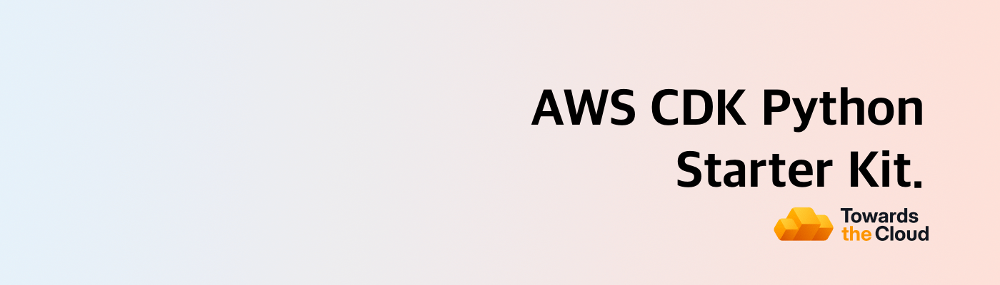

# [](https://towardsthecloud.com)

# AWS CDK Python Starter Kit

Production-ready AWS CDK Python starter kit template with secure OIDC authentication and automated CI/CD. Deploy infrastructure to AWS in minutes with projen-powered configuration.

## 🚀 Features

- **⚡ Rapid Setup**: Jumpstart your project within minutes by tweaking a [single configuration file (projen)](./.projenrc.py)
  - Preconfigured Python with optimized pip dependency management in [requirements.txt](./requirements.txt)
  - Pre-configured linting & formatting with [Ruff](https://github.com/astral-sh/ruff) for code quality
  - Clean [project structure](#project-structure) for easy management of constructs and stacks
- **🛡️ Seamless Security**: OIDC authentication for keyless AWS deployments - no stored credentials or long-lived secrets required
- **🤖 Automated CI/CD**: Out-of-the-box GitHub Actions workflows with multi-account support for enterprise-ready deployments
- **🚀 Enhanced Pull Requests**: Built-in pull request template for structured and informative code reviews

<!-- TIP-LIST:START -->
> [!TIP]
> **Stop AWS bill surprises from happening.**
>
> Most infrastructure changes look harmless until you see next month's AWS bill. [CloudBurn](https://cloudburn.io) prevents this by analyzing the cost impact of your AWS CDK changes directly in GitHub pull requests, catching expensive mistakes during code review when fixes are quick, not weeks later when they're costly and risky.
>
> <a href="https://github.com/apps/cloudburn-io"></a>
>
> <details>
> <summary>💰 <strong>Set it up once, then never be surprised by AWS costs again</strong></summary>
> <br/>
>
> 1. **First install the free [CDK Diff PR Commenter GitHub Action](https://github.com/marketplace/actions/aws-cdk-diff-pr-commenter)** in your repository where you build your AWS CDK infrastructure
> 2. **Then install the [CloudBurn GitHub App](https://github.com/apps/cloudburn-io)** on the same repository
>
> **What happens now:**
>
> Whenever you open a PR with infrastructure changes, the GitHub Action comments with your CDK diff analysis. CloudBurn reads that diff and automatically adds a separate comment with a detailed cost report showing:
> - **Monthly cost impact** – Will this change increase or decrease your AWS bill? By how much?
> - **Per-resource breakdown** – See exactly which resources are driving costs (old vs. new monthly costs)
> - **Region-aware pricing** – We pick the right AWS pricing based on the region where your infrastructure is deployed
>
> Your team can now validate cost impact alongside infrastructure changes during code review. Essentially, this shifts FinOps left where you optimize costs as you code, not weeks later when context is lost and production adjustments require more time and carry added risk.
>
> CloudBurn will be free during beta. After launch, a free Community plan (1 repository with unlimited users) will always be available.
>
> </details>
<!-- TIP-LIST:END -->

## Setup Guide

All the config that is needed to personalise the CDK App to your environment is defined in the [.projenrc.py file](./.projenrc.py).

**To get started, follow these steps:**

1. Click the green ["Use this template"](https://github.com/new?template_name=aws-cdk-python-starter-kit&template_owner=towardsthecloud) button to create a new repository based on this starter kit.

2. Add a Personal Access Token to the repository settings on GitHub, follow these [instructions for setting up a fine-grained personal access token](https://projen.io/docs/integrations/github/#fine-grained-personal-access-token-beta).

3. Install the AWS CDK CLI and projen: `npm install -g aws-cdk projen`

4. Install the projects dependencies using: `pip install -r requirements.txt` and `pip install -r requirements-dev.txt`

5. Customize the AWS Region and Account IDs in the [.projenrc.py](./.projenrc.py) file to match your AWS setup:

```python
# Define the AWS region for the CDK app and github workflows
# Default to us-east-1 if AWS_REGION is not set in your environment variables
aws_region = os.getenv("AWS_REGION", "us-east-1")

# Set the CDK_DEFAULT_REGION environment variable for the projen tasks,
# so the CDK CLI knows which region to use
project.tasks.add_environment("CDK_DEFAULT_REGION", aws_region)

# Define the target AWS accounts for the different environments
target_accounts = {
    "dev": "987654321012",
    "test": "123456789012",
    "staging": None,
    "production": None,
}
```

6. Run `projen` to generate the github actions workflow files.

7. AWS CLI Authentication: Ensure you're logged into an AWS Account (one of the ones you configured in step 4) via the AWS CLI. If you haven't set up the AWS CLI, [then follow this guide](https://towardsthecloud.com/set-up-aws-cli-aws-sso))

8. Deploy the CDK toolkit stack to your AWS environment with `cdk bootstrap` if it's not already set up.

9. Deploy the GitHub OIDC Stack to enable GitHub Actions workflow permissions for AWS deployments. For instance, if you set up a `dev` environment, execute `projen dev:deploy`.

10. Commit and push your changes to the `main` branch to trigger the CDK deploy pipeline in GitHub.

Congratulations 🎉! You've successfully set up your project.

## Project Structure

When working on smaller projects using infrastructure as code, where you deploy single applications that don’t demand extensive maintenance or collaboration from multiple teams, it’s recommended to structure your AWS CDK project in a way that enables you to deploy both the application and infrastructure using a single stack.

However, as projects evolve to encompass multiple microservices and a variety of stateful resources (e.g., databases), the complexity inherently increases.

In such cases, adopting a more sophisticated AWS CDK project organization becomes critical. This ensures not only the ease of extensibility but also the smooth deployment of each component, thereby supporting a more robust development lifecycle and facilitating greater operational efficiency.

To cater to these advanced needs, your AWS CDK project should adopt a modular structure. This is where the **AWS CDK Python Starter Kit** shines ✨.

Here’s a closer look at how this structure enhances maintainability and scalability:

```bash
.
├── cdk.json
├── requirements.txt
├── requirements-dev.txt
├── README.md
├── src
│  ├── __init__.py
│  ├── app.py
│  ├── assets
│  │  ├── ecs
│  │  │  └── hello-world
│  │  │     └── Dockerfile
│  │  └── lambda
│  │     └── hello-world
│  │        └── lambda_function.py
│  ├── bin
│  │  ├── cicd_helper.py
│  │  ├── env_helper.py
│  │  └── git_helper.py
│  ├── custom_constructs
│  │  ├── __init__.py
│  │  ├── base_construct.py
│  │  ├── network_construct.py
│  │  └── README.md
│  └── stacks
│     ├── __init__.py
│     ├── base_stack.py
│     ├── github_oidc_stack.py
│     └── README.md
└── tests
   ├── __init__.py
   └── test_example.py
```

As you can see in the above tree diagram, the way this project is setup it tries to segment it into logical units, such as **constructs** for reusable infrastructure patterns, **stacks** for deploying groups of resources and **assets** for managing source code of containers and lambda functions.

Here is a brief explanation of what each section does:

- `src/assets`: Organizes the assets for your Lambda functions and ECS services, ensuring that the application code is neatly encapsulated with the infrastructure code.
- `src/bin`: Contains utility scripts (e.g., `cicd_helper.py`, `env_helper.py`, `git_helper.py`) that streamline environment setup and integration with CI/CD pipelines.
- `src/custom_constructs`: Houses the core building blocks of your infrastructure. These constructs can be composed into higher-level abstractions, promoting reusability across different parts of your infrastructure. Check out the [README in the constructs folder](./src/custom_constructs/README.md) to read how you can utilize environment-aware configurations.
- `src/stacks`: Dedicated to defining stacks that represent collections of AWS resources (constructs). This allows for logical grouping of related resources, making it simpler to manage deployments and resource dependencies. Check out the [README in the stacks folder](./src/stacks/README.md) to read how you can instantiate new stacks.
- `src/lib/main.ts`: This is where the CDK app is instantiated.
- `test`: Is the location to store your unit or integration tests (powered by jest)

## AWS CDK Starter Kit for TypeScript Users

> **Looking for the TypeScript version of this AWS CDK Starter Kit?** Check out the [AWS CDK Starter Kit](https://github.com/towardsthecloud/aws-cdk-starter-kit) for a tailored experience that leverages the full power of AWS CDK with TypeScript.

## Acknowledgements

A heartfelt thank you to the creators of [projen](https://github.com/projen/projen). This starter kit stands on the shoulders of giants, made possible by their pioneering work in simplifying cloud infrastructure projects!

## Author

[Danny Steenman](https://towardsthecloud.com/about)

[](https://www.linkedin.com/company/towardsthecloud)
[](https://twitter.com/dannysteenman)
[](https://github.com/towardsthecloud)
