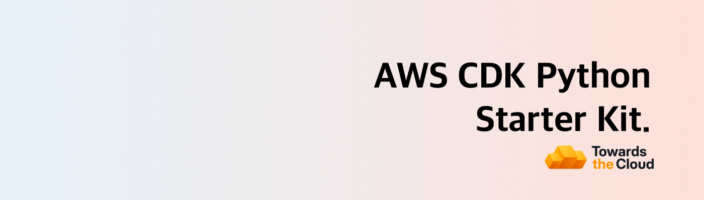

# [](https://towardsthecloud.com)

# AWS CDK Python Starter Kit

Production-ready AWS CDK Python starter kit template with secure OIDC authentication and automated CI/CD. Deploy infrastructure to AWS in minutes with projen-powered configuration.

## 🚀 Features

- **⚡ Rapid Setup**: Jumpstart your project within minutes by tweaking a [single configuration file (projen)](./.projenrc.py)
  - Preconfigured Python with uv dependency management via [pyproject.toml](./pyproject.toml)
  - Pre-configured linting & formatting with [Ruff](https://github.com/astral-sh/ruff) for code quality
  - Clean [project structure](#project-structure) for easy management of constructs and stacks
- **🛡️ Seamless Security**: OIDC authentication for keyless AWS deployments - no stored credentials or long-lived secrets required
- **🤖 Automated CI/CD**: Out-of-the-box GitHub Actions workflows with multi-account support for enterprise-ready deployments
- **🚀 Enhanced Pull Requests**: Built-in pull request template for structured and informative code reviews

<!-- TIP-LIST:START -->
> [!TIP]
> **We eliminate AWS complexity so you ship faster, spend less, and stay compliant.**
>
> Our managed AWS service gives you three things: a production-grade AWS CDK Landing Zone with built-in compliance controls, proactive monitoring that stops cost waste and security drift, and senior AWS expertise that speeds up your team's delivery.
>
> Book a free demo to see where you stand and what we'd fix first:
>
> <a href="https://towardsthecloud.com/services/aws-cdk-landing-zone#cta"></a>
>
> <details>
> <summary>⚡ <strong>See the symptoms of a missing AWS foundation and how we solve them</strong></summary>
> <br/>
>
> AWS starts simple. Then you scale: production and staging blur together, resources multiply without owners, IAM policies accumulate exceptions, security findings pile up in backlogs, and the bill climbs month after month.
>
> Those are symptoms of a missing AWS foundation. Without one, your developers spend more time fixing problems than shipping features.
>
> **We provide that foundation and own it entirely, so your team focuses on shipping, not firefighting.**
>
> ### Here's what's included:
>
> **1. We Provision a Secure [AWS CDK Landing Zone](https://towardsthecloud.com/services/aws-cdk-landing-zone) That Accelerates Compliance**
> - Multi-account architecture with security controls and compliance guardrails from day one
> - Scores 100% on the [CIS AWS Foundations Benchmark](https://docs.aws.amazon.com/securityhub/latest/userguide/cis-aws-foundations-benchmark.html) and 96% on [AWS Foundational Security Best Practices](https://docs.aws.amazon.com/securityhub/latest/userguide/fsbp-standard.html)
> - Those benchmarks map straight to **SOC 2**, **HIPAA**, and **PCI-DSS** controls, cutting months from your compliance timeline
>
> **2. We Monitor Proactively to Stop Cost Waste and Security Drift**
> - Quarterly cost reviews catch unattached volumes, oversized instances, and orphaned resources before they compound. AWS spend drops 20-30% on average, with [outliers hitting 60+%](https://towardsthecloud.com/services/aws-cost-optimization#case-study)
> - Continuous security monitoring across all accounts catches misconfigurations immediately. You get alerts while issues are still fixable, not after they're breaches
>
> **3. We Provide Senior AWS Expertise That Speeds Up Delivery**
> - Your developers get production-ready IaC templates for common patterns: multi-AZ applications, event-driven architectures, secure data pipelines. What takes weeks of research ships in hours
> - Architecture guidance on VPC design, IAM policies, disaster recovery, and observability from engineers who've solved these problems at enterprise scale
>
> [*"We achieved a perfect security score in days, not months."*](https://towardsthecloud.com/blog/case-study-accolade)
> *Galen Simmons, CEO of Accolade (Y Combinator startup)*
>
> </details>
<!-- TIP-LIST:END -->

## Setup Guide

All the config that is needed to personalise the CDK App to your environment is defined in the [.projenrc.py file](./.projenrc.py).

**To get started, follow these steps:**

1. Click the green ["Use this template"](https://github.com/new?template_name=aws-cdk-python-starter-kit&template_owner=towardsthecloud) button to create a new repository based on this starter kit.

2. Add a Personal Access Token to the repository settings on GitHub, follow these [instructions for setting up a fine-grained personal access token](https://projen.io/docs/integrations/github/#fine-grained-personal-access-token-beta).

3. Install the AWS CDK CLI: `npm install -g aws-cdk`

4. Install uv (if needed) and sync dependencies: `uv sync`

5. Customize the AWS Region and Account IDs in the [.projenrc.py](./.projenrc.py) file to match your AWS setup:

```python
# Define the AWS region for the CDK app and github workflows
# Default to us-east-1 if AWS_REGION is not set in your environment variables
aws_region = os.getenv("AWS_REGION", "us-east-1")

# Set the CDK_DEFAULT_REGION environment variable for the projen tasks,
# so the CDK CLI knows which region to use
project.tasks.add_environment("CDK_DEFAULT_REGION", aws_region)

# Define the target AWS accounts for the different environments
target_accounts = {
    "dev": "987654321012",
    "test": "123456789012",
    "staging": None,
    "production": None,
}
```

6. Run `uv run projen` to generate the github actions workflow files.

7. AWS CLI Authentication: Ensure you're logged into an AWS Account (one of the ones you configured in step 4) via the AWS CLI. If you haven't set up the AWS CLI, [then follow this guide](https://towardsthecloud.com/set-up-aws-cli-aws-sso))

8. Deploy the CDK toolkit stack to your AWS environment with `cdk bootstrap` if it's not already set up.

9. Deploy the GitHub OIDC Stack to enable GitHub Actions workflow permissions for AWS deployments. For instance, if you set up a `dev` environment, execute `uv run projen dev:deploy`.

10. Commit and push your changes to the `main` branch to trigger the CDK deploy pipeline in GitHub.

Congratulations 🎉! You've successfully set up your project.

## Project Structure

When working on smaller projects using infrastructure as code, where you deploy single applications that don’t demand extensive maintenance or collaboration from multiple teams, it’s recommended to structure your AWS CDK project in a way that enables you to deploy both the application and infrastructure using a single stack.

However, as projects evolve to encompass multiple microservices and a variety of stateful resources (e.g., databases), the complexity inherently increases.

In such cases, adopting a more sophisticated AWS CDK project organization becomes critical. This ensures not only the ease of extensibility but also the smooth deployment of each component, thereby supporting a more robust development lifecycle and facilitating greater operational efficiency.

To cater to these advanced needs, your AWS CDK project should adopt a modular structure. This is where the **AWS CDK Python Starter Kit** shines ✨.

Here’s a closer look at how this structure enhances maintainability and scalability:

```bash
.
├── cdk.json
├── pyproject.toml
├── uv.lock
├── README.md
├── src
│  ├── __init__.py
│  ├── app.py
│  ├── assets
│  │  ├── ecs
│  │  │  └── hello-world
│  │  │     └── Dockerfile
│  │  └── lambda
│  │     └── hello-world
│  │        └── lambda_function.py
│  ├── bin
│  │  ├── cicd_helper.py
│  │  ├── env_helper.py
│  │  └── git_helper.py
│  ├── custom_constructs
│  │  ├── __init__.py
│  │  ├── base_construct.py
│  │  ├── network_construct.py
│  │  └── README.md
│  └── stacks
│     ├── __init__.py
│     ├── base_stack.py
│     ├── github_oidc_stack.py
│     └── README.md
└── tests
   ├── __init__.py
   └── test_example.py
```

As you can see in the above tree diagram, the way this project is setup it tries to segment it into logical units, such as **constructs** for reusable infrastructure patterns, **stacks** for deploying groups of resources and **assets** for managing source code of containers and lambda functions.

Here is a brief explanation of what each section does:

- `src/assets`: Organizes the assets for your Lambda functions and ECS services, ensuring that the application code is neatly encapsulated with the infrastructure code.
- `src/bin`: Contains utility scripts (e.g., `cicd_helper.py`, `env_helper.py`, `git_helper.py`) that streamline environment setup and integration with CI/CD pipelines.
- `src/custom_constructs`: Houses the core building blocks of your infrastructure. These constructs can be composed into higher-level abstractions, promoting reusability across different parts of your infrastructure. Check out the [README in the constructs folder](./src/custom_constructs/README.md) to read how you can utilize environment-aware configurations.
- `src/stacks`: Dedicated to defining stacks that represent collections of AWS resources (constructs). This allows for logical grouping of related resources, making it simpler to manage deployments and resource dependencies. Check out the [README in the stacks folder](./src/stacks/README.md) to read how you can instantiate new stacks.
- `src/lib/main.ts`: This is where the CDK app is instantiated.
- `test`: Is the location to store your unit or integration tests (powered by jest)

## AWS CDK Starter Kit for TypeScript Users

> **Looking for the TypeScript version of this AWS CDK Starter Kit?** Check out the [AWS CDK Starter Kit](https://github.com/towardsthecloud/aws-cdk-starter-kit) for a tailored experience that leverages the full power of AWS CDK with TypeScript.

## Acknowledgements

A heartfelt thank you to the creators of [projen](https://github.com/projen/projen). This starter kit stands on the shoulders of giants, made possible by their pioneering work in simplifying cloud infrastructure projects!

## Author

[Danny Steenman](https://towardsthecloud.com/about)

[](https://www.linkedin.com/company/towardsthecloud)
[](https://twitter.com/dannysteenman)
[](https://github.com/towardsthecloud)
